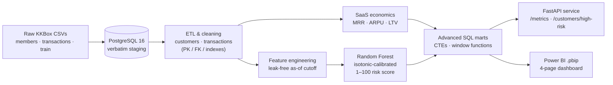

# Customer Churn Prediction & Business Performance Engine

<p>
  
  
  
  
  
  
</p>

An **end-to-end data engine** that takes raw subscription data all the way from a database to an
executive dashboard: it ingests ~**23M real subscription transactions**, cleans and models them in
**PostgreSQL**, computes core **SaaS economics** (MRR, ARPU, LTV), trains a **calibrated machine-learning
model** that scores every active customer **1–100 for churn risk**, and serves the results through a
**FastAPI** layer and a **4-page Power BI dashboard**.

The goal is to demonstrate the full bridge that a business actually needs — **raw data → ETL → ML →
API → BI** — and to end on a *decision*, not just a chart.

> ### 📌 Headline results
> - 📈 Monthly recurring revenue grew from **~NT$80M → ~NT$279M / month** over the observed period.
> - ⚠️ **Manual-pay customers churn at 37% vs 5% for auto-renew** — roughly **7× higher**, the single
>   strongest churn signal in the data.
> - 🎯 A Random-Forest model scores active users **1–100** with **ROC-AUC 0.907** and is well-calibrated
>   (band 1 → 2.2% actual churn, band 10 → 94.8%).
> - 💰 The riskiest **~10% of customers hold ~NT$13.8M / month** of revenue at risk — retaining even a
>   fraction of them justifies the whole retention effort.

> 💱 Currency is **NT$** (New Taiwan Dollar): the dataset comes from **KKBox**, a Taiwanese music-streaming service.

---

## 🏗️ Architecture



---

## 🛠️ Tech stack & why

| Layer | Tools | Role |
|---|---|---|
| **Database** | PostgreSQL 16 (Docker Compose) | Staging + clean relational schema; set-based ETL |
| **Ingestion** | Python, `kaggle`, `py7zr`, `COPY` | Acquire the Kaggle dataset, load verbatim staging tables |
| **ETL / cleaning** | Python, SQLAlchemy, pandas | Profile, clean, and model `customers` + `transactions` |
| **Analytics** | Python, advanced SQL | SaaS economics + BI marts (CTEs, `LEAD`/`LAG`/`SUM OVER`) |
| **Machine learning** | scikit-learn, NumPy | Random-Forest churn classifier, isotonic calibration, 1–100 risk score |
| **API** | FastAPI, Uvicorn, Pydantic | Read-only service over the results, OpenAPI docs |
| **BI** | Power BI (PBIP / TMDL / DAX / Power Query) | 4-page executive dashboard |
| **Quality** | pytest, ruff, pinned `requirements.txt` | Reproducibility and hygiene |

---

## 🗂️ The data

[**KKBox Churn Prediction Challenge**](https://www.kaggle.com/c/kkbox-churn-prediction-challenge) (WSDM Cup 2018, Kaggle) — **real, messy production data**, no synthetic rows.

| Source table | Rows |
|---|---:|
| `raw_members` (`members_v3`) | 6,769,473 |
| `raw_transactions` (`transactions` + `v2`) | 22,978,755 |
| `raw_train` (`train` + `v2`, churn labels) | 1,963,891 |
| → cleaned `customers` | 2,426,143 |
| → labeled customers (8.99% churn) | 970,960 |

The 30 GB `user_logs` behavioural firehose is **intentionally out of scope** (not laptop-loadable). Raw
data is **git-ignored**; only the small aggregated BI marts are committed so the dashboard opens on clone.

---

## 🔬 Pipeline (5 phases)

1. **Acquisition & infrastructure** — PostgreSQL 16 via Docker; Kaggle CLI download; `src/ingestion/load_raw.py`
   loads three verbatim staging tables via `COPY` (row counts verified against source).
2. **Cleaning & ETL** — profiled the raw data (67% out-of-range ages, 65% missing gender, epoch/2036 junk
   expiry dates, label overlap), then built a clean schema with a documented null+flag strategy, parsed
   dates, and added keys/indexes. Methodology: [`docs/data-cleaning.md`](docs/data-cleaning.md).
3. **Business logic & ML** — computed MRR / ARPU / LTV; engineered a **leak-free** feature table
   (2,391,675 × 27) as of the **2017-02-28 cutoff**; trained an isotonic-calibrated **Random Forest**
   (**ROC-AUC 0.907**, PR-AUC 0.629); wrote a 1–100 risk score for every customer. Details:
   [`docs/phase3-metrics-and-model.md`](docs/phase3-metrics-and-model.md).
4. **API** — FastAPI read-only service with a DB-isolating service layer, Pydantic DTOs, pagination, and
   `404 / 422 / 503` handling.
5. **BI preparation** — advanced SQL views/matviews → `src/analytics/build_bi.py` exports 7 CSV marts →
   the Power BI `.pbip` project. See [`powerbi/README.md`](powerbi/README.md).

---

## 📁 Repository structure

```
churn-prediction-engine/
├── data/                  # raw/interim/processed (git-ignored)
├── src/
│   ├── ingestion/         # Phase 1 — load raw staging tables (COPY)
│   ├── etl/               # Phase 2 — clean & model customers/transactions
│   ├── analytics/         # Phase 3/5 — SaaS metrics + BI mart export
│   ├── ml/                # Phase 3 — features + train/score churn model
│   └── api/               # Phase 4 — FastAPI app (main/service/schemas)
├── sql/                   # Phase 5 — BI SQL (CTEs + window functions)
├── docs/                  # data-cleaning + metrics/model methodology
├── powerbi/               # Power BI .pbip project + theme + marts
├── notebooks/             # exploratory analysis
├── docker-compose.yml     # PostgreSQL 16
├── requirements.txt       # pinned dependencies
└── .env.example           # DB connection template
```

---

## 🚀 Quickstart

> Prerequisites: **Docker**, **Python 3.11+**, and (for Phase 1 only) a Kaggle account + the dataset.

```bash
# 1 — clone & enter
git clone https://github.com/hickennoace/churn-prediction-engine.git
cd churn-prediction-engine

# 2 — Python environment
python -m venv .venv
source .venv/bin/activate          # Windows: .venv\Scripts\activate
pip install -r requirements.txt

# 3 — database + secrets
cp .env.example .env               # fill in DB_* values
docker compose up -d               # PostgreSQL 16 on :5432

# 4 — run the pipeline
python -m src.ingestion.load_raw   # Phase 1  (needs Kaggle CSVs in data/raw/)
python -m src.etl.clean            # Phase 2
python -m src.analytics.metrics    # Phase 3  (SaaS economics)
python -m src.ml.features          # Phase 3  (feature engineering)
python -m src.ml.train_model       # Phase 3  (train + 1–100 scoring)
python -m src.analytics.build_bi   # Phase 5  (export Power BI marts)

# 5 — serve the API
uvicorn src.api.main:app --port 8000   # docs at http://localhost:8000/docs
```

### Opening the dashboard
Open **`powerbi/ChurnEngine/ChurnEngine.pbip`** in **Power BI Desktop** (enable
*File → Options → Preview features → "Power BI Project (.pbip) save option"*). Full notes — theme,
refresh, and the 4 pages — are in [`powerbi/README.md`](powerbi/README.md).

---

## 🌐 API endpoints

| Method | Endpoint | Description |
|---|---|---|
| `GET` | `/metrics` | Business KPIs; pass `?cac=` for a real LTV:CAC ratio |
| `GET` | `/customers/high-risk` | Paginated high-risk customers (`limit` / `offset` / `min_score`) |
| `GET` | `/customer?msno=` | Single customer's risk profile |
| `GET` | `/health` | Liveness/readiness check |
| `GET` | `/docs` | Interactive Swagger UI (OpenAPI) |

> **CAC note:** the dataset has no acquisition-cost data, so CAC is **never fabricated** — the API takes it
> as an optional input (`/metrics?cac=`) and returns the LTV:CAC ratio only when you supply a real figure.

---

## 📊 Results & conclusions

- **Revenue is growing fast** — MRR climbed from ~NT$80M to ~NT$279M / month over the observed window
  (ARPU ~NT$128, LTV ~NT$1,424, ~11-month average lifetime).
- **Billing method is destiny** — manual-pay customers churn at **37%** vs **5%** on auto-renew (~**7×**).
  Auto-renew status is the strongest single churn signal in the model.
- **Churn is concentrated, and so is the money** — ~9% of the paying base churns monthly, but the
  riskiest **~10% of customers carry ~NT$13.8M / month** of revenue at risk.
- **The model is trustworthy and actionable** — ROC-AUC **0.907**, well-calibrated across all ten risk
  bands, producing a 1–100 score the business can target directly (e.g. proactive outreach + a nudge from
  manual-pay to auto-renew on the high-risk band).

**Recommendation:** prioritise auto-renew conversion and proactive retention on the top risk band — the
revenue-at-risk math shows this pays for itself many times over.

---

## 📝 Notes & limitations

- Built on a **point-in-time cutoff (2017-02-28)** to predict the March-2017 expiry cohort; all features
  are leak-free relative to that date.
- The Power BI model imports CSVs via **absolute paths**; if you move the project, repoint the queries
  (see [`powerbi/README.md`](powerbi/README.md)).
- This is a **portfolio project** built end-to-end on a single dataset to showcase the full analytics stack.

---

<sub>Built by <b>Daniel Shaulov</b> · <a href="https://github.com/hickennoace">github.com/hickennoace</a> · <a href="https://danielshaulov.vercel.app">portfolio</a></sub>
